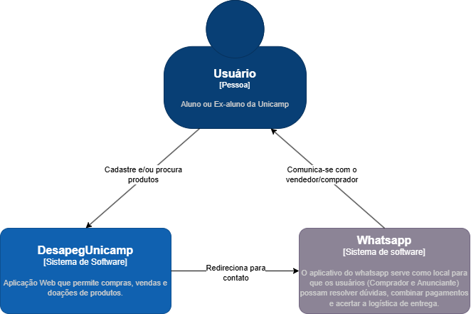
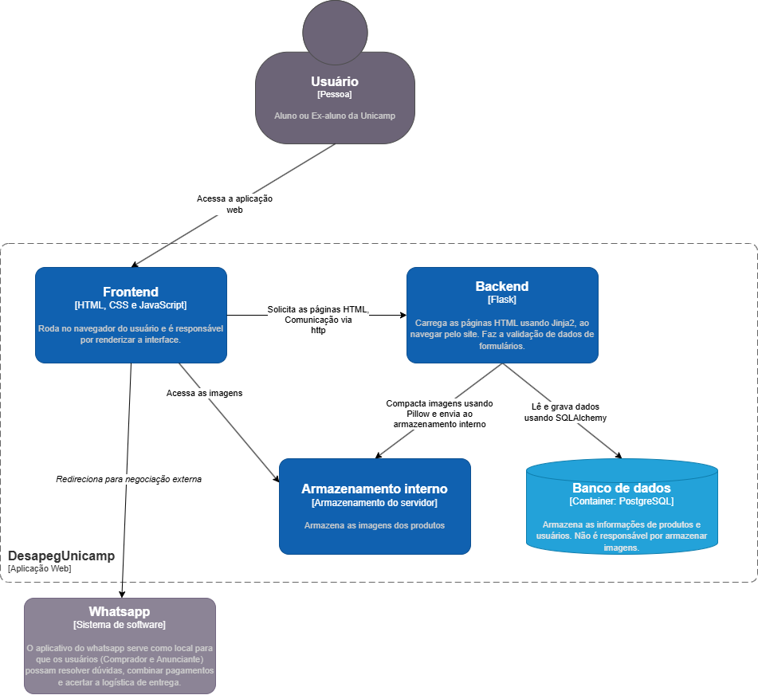
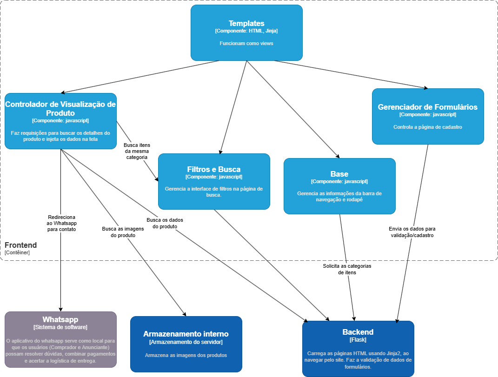
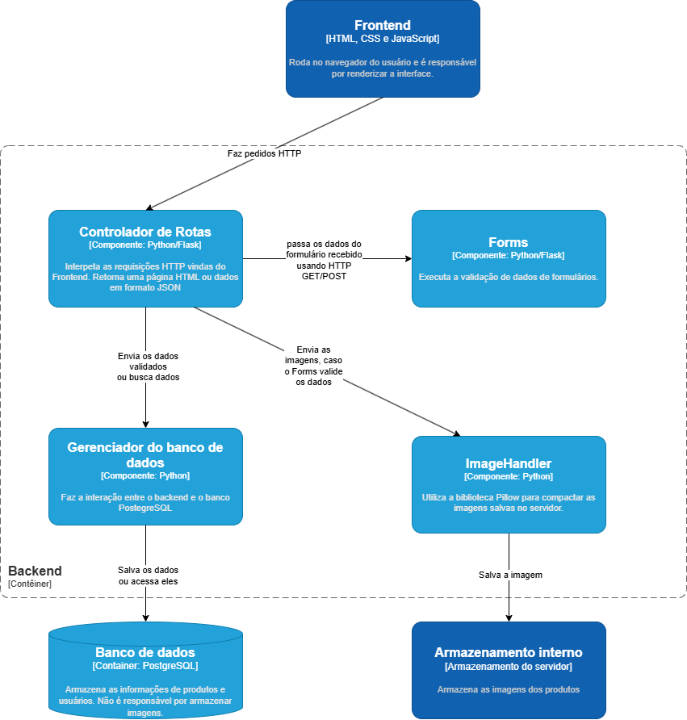

# Economia Circular
Um marketplace focado em conectar pessoas recém chegadas a uma universidade que precisam de algum tipo de material a pessoas prestes a sair da universidade que querem doar ou vender esse mesmo material. Esse projeto está inserido no objetivo 12.5, com título "Consumo e produção responsáveis"

## Integrantes
- Daniel Soares Franco - 259083
- Gabriel Pinto Costa - 245912
- Vinícius de Oliveira Silva -251527
- Lucas Beserra Fernandes - 281815

## Como executar
Para garantir o funcionamento do projeto, primeiro é necessário criar e ativar um ambiente virtual Python. Como por exemplo, utilizando: \
```python -m venv venv``` e depois: \
**Linux:** ```source venv/bin/activate```\
**Windows(PowerShell):** ```venv\Scripts\activate.ps1```

Dentro do ambiente, é necessário baixar as dependências do projeto com:\
```pip install -r requirements.txt```

Para iniciar o servidor local da aplicação web, primeiro é preciso rodar o seguinte comando:\
**Linux:** ```export FLASK_APP=desapeg/app.py```\
**Windows(PowerShell):** ```$env:FLASK_APP="desapeg/app.py"```

Depois, basta rodar ```flask run```

**Atenção:** É possível popular um mock do banco de dados utilizando o comando ```python -m desapeg.seed```. Com ele, 20 produtos serão criados. Sempre que o mock é populado por esse comando, qualquer item cadastrado manualmente será apagado, pois antes de popular o banco com a seed, o projeto apaga todos os dados já existentes.

## Arquitetura
Para o desenvolvimento deste projeto, foi utilizado o estilo arquitetural MVC. Os templates HTML com Jinja agem como view, com o controlador de rotas no backend e os arquivos javascript agem como Controller e, por fim, partes do código como o ImageHandler e o Gerenciador do banco de dados agem como o Model.

### Diagrama C4
#### Contexto:


#### Contêiner:


#### Componente (Frontend):


#### Componente (Backend):


### Frontend
O Frontend roda no navegador do usuário e é responsável pela apresentação visual, captura de interações e comunicação com o servidor. Ele é estruturado em torno de templates que funcionam como as views do sistema. Nele também há componentes em javascript, que têm objetivos como a busca de itens, exibição de imagens e o redirecionamento para o contato via WhatsApp. Também têm como objevos o gerenciamento dos critérios de pesquisa e controle de elementos como a barra de navegação e o rodapé. Há também o Gerenciador de Formulários, que lida com o comportamento de envio e interações na página de cadastro e atualização de informações de produtos.

### Backend
É desenvolvido em Python com o framework Flask. O Controlador de Rotas interpreta as requisições HTTP que chegam do frontend para retornar dados em JSON ou páginas HTML. Para o cadastro ou atualização de cadastro, os dados de formulários que passam pelo Controlador de Rotas vão para o Forms, que faz a validação das informações submetidas. Para o envio de imagens, o ImageHandler utiliza a biblioteca Pillow e compacta as imagens antes de salvá-las no armazenamento interno do servidor. Para armazenar ou buscar informações no banco de dados, o Gerenciador do Banco de Dados faz a comunicação com o banco PostgreSQL.

Para o componente de Filtros e Busca, é utilizado o padrão de projeto Builder, para auxiliar na construção de diferentes filtros.

**Importante:** Nesta entrega, ainda é utilizado um mock para o banco de dados, então o Gerenciador do Banco de Dados não foi implementado. A implementação desse gerenciador foi iniciada na branch "DB-Connection" do repositório.