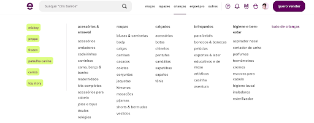
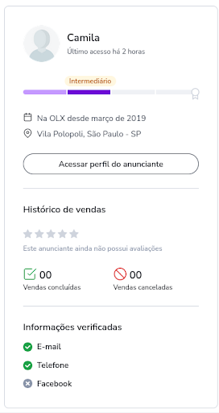
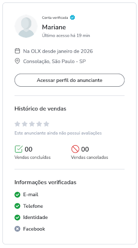
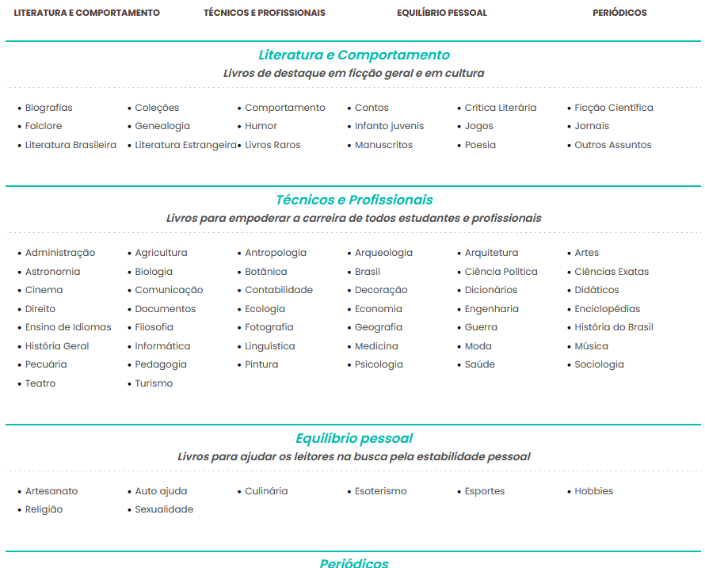

# Técnicas de elicitação de requisitos
Foram utilizadas 3 técnicas de elicitação de requisitos, sendo elas brainstorming, benchmarking, e entrevistas.

## Barinstorming

## Benchmarking
### APLICAÇÕES ANALISADAS
#### Enjoei
O Enjoei tem como objetivo ser uma plataforma de repasse de roupas, produtos de beleza e outros acessórios. Nessa aplicação, vamos analisar o filtro por categoria e a visualização de produtos similares na página do produto.

- **Filtro por categoria**

- Ao lado da barra de pesquisa, existem algumas categorias para a filtragem de produtos por gênero e idade e elas possuem subcategorias. Essa divisão explícita dos produtos permite aos usuários uma busca mais eficiente, ou seja, o site consegue entregar ao usuário o que ele procura de forma mais rápida e direcionada, porém, também gera uma poluição visual e um superestímulo ao usuário ao acessar a categoria principal. 

- **Produtos similares na página do produto**

- Abaixo da página principal de um produto, existe um carrossel de produtos similares com relação ao tipo do anunciado acima. Isso permite que, mesmo que o produto selecionado originalmente não seja o ideal, o usuário pode com rapidez encontrar um produto similar que talvez o agrade mais.

- PONTOS POSITIVOS: grande organização de categorias e tipos de produto, rapidez de acesso à itens similares anunciados.

- PONTOS NEGATIVOS: poluição visual, grande número de propagandas e estímulos.

#### OLX
A OLX é uma plataforma de repasse mais genérica. Ela permite a divulgação de desde eletrônicos até vagas de emprego. Ela atua como um grande mural de classificados online, conectando diretamente vendedores e compradores da mesma região para negociações de itens usados e novos.  Nessa aplicação, vamos analisar duas características: o modelo de contato direto e a verificação do anunciante.

- **Contato Direto**

- A plataforma atua essencialmente como uma vitrine de anúncios. Ao invés de intermediar obrigatoriamente o pagamento e a logística dentro do site, ela fornece os meios para que os interessados entrem em contato direto com os anunciantes. Assim, toda a negociação, trâmites de pagamento e entrega podem ser combinados externamente entre as partes envolvidas.

- **Verificação do anunciante**

- Para mitigar os riscos do contato direto, a página exibe perfis detalhados dos anunciantes. É possível visualizar a localização, há quanto tempo a pessoa possui conta no site e o seu último acesso. Destaca-se também o "Histórico de vendas", com o número de vendas concluídas e canceladas. Além disso, existe a seção de "Informações verificadas", onde o sistema checa dados como e-mail, telefone e identidade (concedendo um selo azul de "Conta verificada", como visto no perfil da Mariane), ajudando a comprovar que o vendedor é uma pessoa real.

- PONTOS POSITIVOS: grande detalhamento do perfil do vendedor e exibição clara de validações, flexibilidade para negociar diretamente com o vendedor.

- PONTOS NEGATIVOS: alta burocratização da obtenção do selo de verificação, contato direto é uma abertura para golpes e compras inseguras.

#### Estante Virtual
A Estante Virtual atua como o maior acervo online de livros do Brasil, conectando leitores diretamente a milhares de sebos e livreiros independentes. Nessa aplicação, vamos analisar a padronização das buscas e a classificação do estado de conservação dos itens.

- **Padronização das buscas e filtros específicos**

- A plataforma possui um sistema de busca altamente estruturado para o seu nicho. É possível procurar produtos utilizando filtros precisos como Título, Autor, Editora e o ISBN. Essa organização permite que o usuário encontre exatamente a edição, o volume ou o ano do livro, evitando compras equivocadas de materiais similares, mas diferentes.

- **Classificação do estado de conservação**

- Por lidar com produtos de segunda mão, o site adota um sistema claro de classificação do estado físico do livro. Os vendedores costumam utilizar termos padronizados nas descrições para indicar avarias detalhadas, como "páginas amareladas" ou "grifos a marca-texto" . Essa transparência alinha as expectativas do comprador antes mesmo de demonstrar interesse no item.

- PONTOS POSITIVOS: sistema de busca focado e extremamente preciso. Exigência de transparência quanto ao desgaste real do produto.

- PONTOS NEGATIVOS: a criação do anúncio mais burocrática e demorada, exigindo que o anunciante preencha muitos campos técnicos.

### FUNCIONALIDADES DE INTERESSE:
- Verificação do anunciante
- Contato direto do comprador com o anunciante
- Transparência do estado dos produtos
- Organização em categorias simples
- Rapidez de acesso à produtos similares na página de anuncio

## Entrevista
O áudio da entrevista pode ser acessado clicando aqui.

### Roteiro de entrevista:

#### 1. Introdução (1 minuto)
- Abertura: Olá! Muito obrigado por topar conversar com a gente. Somos estudantes de Engenharia de Software e estamos desenvolvendo o DesapegUnicamp, uma plataforma focada em economia circular para facilitar a troca, venda e doação de itens entre a comunidade da UNICAMP.

- Alinhamento: Não tem resposta certa ou errada, queremos apenas entender a sua experiência real.

- Gravação: Como parte dos requisitos do nosso projeto acadêmico, precisamos registrar as evidências dessa entrevista. Você se importa se gravarmos o áudio dessa conversa?

#### 2. Perfil do Entrevistado (2-3 minutos)
- Qual o seu curso e há quanto tempo você está na UNICAMP?
- Onde você mora atualmente? 
- Como você costuma se locomover por Barão Geraldo ou pelo campus? 
- Você costuma tomar decisões de compra, venda ou doação de forma individual ou em conjunto com outras pessoas?
- Qual é o seu nível de familiaridade e confiança com plataformas de revenda de usados que já existem no mercado?
- Em uma dessas plataformas, você acredita que seu perfil é de quem anuncia um produto ou de quem busca um produto?

#### 3. Experiências do Entrevistado (5-7 minutos)
- Quando você entrou na universidade ou se mudou, como fez para encontrar os itens essenciais que precisava?
- Você já precisou se desfazer de algum item durante a graduação? Como foi esse processo?
- Você costuma usar grupos de Facebook ou WhatsApp para isso? O que você mais gosta e o que mais te frustra na forma como esses grupos funcionam hoje?
- Você já teve algum problema de segurança, comunicação ou logística ao negociar itens com outras pessoas da universidade?

#### 4.  Sobre a Plataforma(5-7 minutos)
- Se você fosse usar uma plataforma como o DesapegUnicamp hoje, qual seria o fator decisivo para você preferir usá-la ao invés dos grupos de WhatsApp/Facebook?
- Pensando nas funcionalidades, o que você consideraria essencial para o site e o que seria apenas um "bônus"?
- Para doações especificamente, o que te incentivaria a doar um item pela plataforma ao invés de simplesmente jogá-lo fora?
- Como você gostaria de ser notificado caso alguém demonstre interesse no seu produto ou caso um item que você está precisando muito seja anunciado? 

#### 5. Encerramento (1-2 minutos)
- Tem mais alguma ideia, sugestão ou comentário sobre a doação/venda de itens na comunidade da UNICAMP que não abordamos aqui?
- Muito obrigado pelo seu tempo! Suas respostas vão ajudar muito a guiar o nosso projeto.
